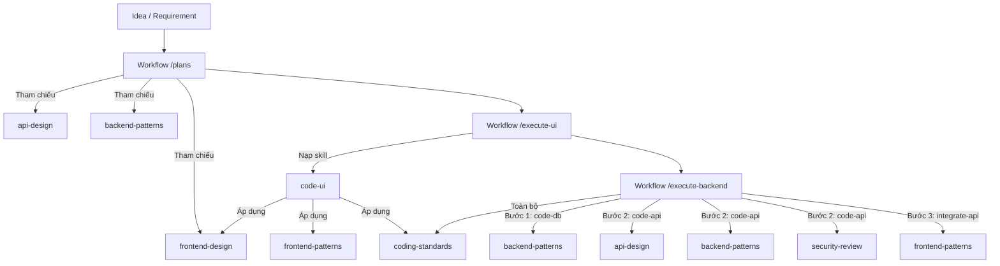

# 📋 SKILL REGISTRY & WORKFLOW MAPPING

Tài liệu đăng ký và ánh xạ toàn bộ các kỹ năng mở rộng (**Extension Skills**) trong thư mục [`.agent/skills/extensions`](file:///d:/vibe_coding/ecommerce-platform/.agent/skills/extensions) vào các quy trình làm việc (**Workflows**) của hệ thống.

---

## 🗺️ 1. BẢNG MA TRẬN ÁNH XẠ WORKFLOW (WORKFLOW MAPPING MATRIX)

| Extension Skill | File Định Nghĩa | Giai Đoạn / Workflows Liên Kết | Mục Đích Sử Dụng Chính |
| :--- | :--- | :--- | :--- |
| **`coding-standards`** | [`SKILL.md`](file:///d:/vibe_coding/ecommerce-platform/.agent/skills/extensions/coding-standards/SKILL.md) | **Tất cả Workflows** (`/plans`, `/execute-ui`, `/execute-backend`) | Quy chuẩn code sạch (KISS/DRY/YAGNI), Immutability, Type Safety, chống Code Smells. |
| **`frontend-design`** | [`SKILL.md`](file:///d:/vibe_coding/ecommerce-platform/.agent/skills/extensions/frontend-design/SKILL.md) | `/plans` (Design Brief), `/execute-ui` (Bước 1 & 2) | Định hình phong cách thị giác (Visual Direction), Layout độc đáo, Typography, Palette màu có chủ đích, chống UI generic AI. |
| **`frontend-patterns`** | [`SKILL.md`](file:///d:/vibe_coding/ecommerce-platform/.agent/skills/extensions/frontend-patterns/SKILL.md) | `/execute-ui` (Bước 2), `/execute-backend` (Bước 3 - UI Integration) | Kiến trúc React/Next.js (Component Composition, Compound Components, Custom Hooks `useDebounce`, State, Virtualization, Error Boundary). |
| **`api-design`** | [`SKILL.md`](file:///d:/vibe_coding/ecommerce-platform/.agent/skills/extensions/api-design/SKILL.md) | `/plans` (Backend Plan), `/execute-backend` (Bước 2: Code API) | Thiết kế RESTful API chuẩn mực (Resource naming kebab-case/số nhiều, HTTP status codes, Envelope responses, Pagination cursor/offset, Filtering/Sorting). |
| **`backend-patterns`** | [`SKILL.md`](file:///d:/vibe_coding/ecommerce-platform/.agent/skills/extensions/backend-patterns/SKILL.md) | `/plans` (Backend Plan), `/execute-backend` (Bước 2: Code API) | Kiến trúc Backend đa tầng (Controller - Service - Repository), chống N+1 queries, Prisma/SQL Transaction, Caching Redis, Queue, Logging. |
| **`security-review`** | [`SKILL.md`](file:///d:/vibe_coding/ecommerce-platform/.agent/skills/extensions/security-review/SKILL.md) | `/execute-backend` (Bước 1, 2, 3), Nghiệm thu / Pre-deployment | Bảo mật Secret/Env, Schema Validation (Zod/class-validator), chống SQL Injection, HttpOnly Cookie JWT Auth, Rate Limiting, Redact log. |
| **`nextjs-turbopack`** | [`SKILL.md`](file:///d:/vibe_coding/ecommerce-platform/.agent/skills/extensions/nextjs-turbopack/SKILL.md) | `/execute-ui`, `/execute-backend` (Frontend BFF/SSR), Build & Dev | Tối ưu thời gian chạy dev (Turbopack, File-system caching), tối ưu kích thước bundle và phân tích dependencies. |
| **`frontend-slides`** | [`SKILL.md`](file:///d:/vibe_coding/ecommerce-platform/.agent/skills/extensions/frontend-slides/SKILL.md) | Bổ trợ trình diễn (Demo/Pitch/Workshop) | Dựng Slide thuyết trình HTML/CSS zero-dependency chạy native trình duyệt, Viewport 100vh, hiệu ứng animation mượt mà. |

---

## 🛠️ 2. CHI TIẾT DANH MỤC SKILLS & ĐIỂM KÍCH HOẠT

### 1. `coding-standards`
- **Đường dẫn:** [`.agent/skills/extensions/coding-standards/SKILL.md`](file:///d:/vibe_coding/ecommerce-platform/.agent/skills/extensions/coding-standards/SKILL.md)
- **Phạm vi (Scope):** Nền tảng quy chuẩn viết mã áp dụng cho toàn bộ các file code (TypeScript/JavaScript/React/NestJS).
- **Khi nào kích hoạt:**
  - Viết mới bất kỳ hàm, component, service hay module nào.
  - Tái cấu trúc (refactoring) hoặc review mã nguồn.
- **Quy chuẩn bắt buộc:**
  - Đặt tên biến/hàm mang tính mô tả cao, tuân thủ `verb-noun` (VD: `fetchMarketData`, `isUserAuthenticated`).
  - **Bắt buộc tính bất biến (Immutability):** Dùng toán tử Spread `...`, tuyệt đối không mutate mảng/object trực tiếp.
  - **Type Safety:** CẤM dùng `any`. Mọi DTO, Props, Model phải có type/interface rõ ràng.
  - **Async/Await:** Sử dụng `Promise.all` cho các tác vụ bất đồng bộ độc lập thay vì gọi tuần tự.
  - **Phát hiện Code Smells:** Chặn hàm quá 50 dòng, hạn chế lồng điều kiện sâu (>4 cấp, ưu tiên Early Return), không dùng Magic Numbers.

---

### 2. `frontend-design`
- **Đường dẫn:** [`.agent/skills/extensions/frontend-design/SKILL.md`](file:///d:/vibe_coding/ecommerce-platform/.agent/skills/extensions/frontend-design/SKILL.md)
- **Phạm vi (Scope):** Định hình ngôn ngữ thiết kế, tư duy thẩm mỹ và trải nghiệm thị giác cho giao diện người dùng.
- **Khi nào kích hoạt:**
  - Quy hoạch `design-brief` trong `/plans`.
  - Dựng giao diện mới từ đầu hoặc nâng cấp UI trong `/execute-ui`.
  - Chuyển đổi ý tưởng thô thành giao diện có chiều sâu, đẳng cấp.
- **Quy chuẩn bắt buộc:**
  - **Xác định Visual Direction rõ ràng:** Chọn 1 phong cách chủ đạo (Minimal, Editorial, Bento, Industrial, Luxury...) và nhất quán đến cùng.
  - **Hệ thống Token & Palette:** Sử dụng hệ màu Tailwind và biến CSS chuẩn của dự án, 1 màu chủ đạo + điểm nhấn có chọn lọc, cấm dùng màu gradient tím generic bừa bãi.
  - **Bố cục & Không gian:** Phá cách lưới khi cần tạo điểm nhấn phân cấp (Asymmetry, Overlap, Spacing rhythm).
  - **Ý nghĩa chuyển động (Motion):** Hiệu ứng animation có chủ đích (reveal hierarchy), không lạm dụng micro-interaction gây rối mắt.

---

### 3. `frontend-patterns`
- **Đường dẫn:** [`.agent/skills/extensions/frontend-patterns/SKILL.md`](file:///d:/vibe_coding/ecommerce-platform/.agent/skills/extensions/frontend-patterns/SKILL.md)
- **Phạm vi (Scope):** Các mẫu thiết kế Component, Quản lý State, Custom Hooks và Tối ưu hóa hiệu năng React / Next.js.
- **Khi nào kích hoạt:**
  - Thi công UI Component trong `/execute-ui` (gọi bởi `code-ui`).
  - Tích hợp API và State Management trong `/execute-backend` (gọi bởi `integrate-api`).
- **Quy chuẩn bắt buộc:**
  - **Component Patterns:** Ưu tiên Component Composition (`Card`, `CardHeader`, `CardBody`) và Compound Components (`Tabs`, `TabList`, `Tab`).
  - **Custom Hooks:** Bọc các xử lý debounce (`useDebounce`), data query (`useQuery`), toggle state (`useToggle`).
  - **State Management:** Phân tầng rõ ràng giữa `useState` cục bộ, Zustand store cho global client state, và URL Query params cho filter/search/pagination.
  - **Tối ưu hiệu năng:** Memoization (`useMemo`, `useCallback`, `React.memo`), Lazy loading với `Suspense`, Virtualization (`@tanstack/react-virtual`) cho danh sách dài.
  - **Accessibility & UX:** Hỗ trợ đầy đủ phím điều hướng (Keyboard navigation), Focus management, và Error Boundary.

---

### 4. `api-design`
- **Đường dẫn:** [`.agent/skills/extensions/api-design/SKILL.md`](file:///d:/vibe_coding/ecommerce-platform/.agent/skills/extensions/api-design/SKILL.md)
- **Phạm vi (Scope):** Quy chuẩn thiết kế đường ống REST API chuẩn Enterprise.
- **Khi nào kích hoạt:**
  - Lập tài liệu API Contract trong `backend-plans` của workflow `/plans`.
  - Viết Controller và Route Endpoints trong Bước 2 của workflow `/execute-backend`.
- **Quy chuẩn bắt buộc:**
  - **URL Structure:** Resource dạng danh từ số nhiều, chữ thường, kebab-case (VD: `/api/v1/users`, `/api/v1/users/:id/orders`). Cấm gắn động từ vào URL (như `/getUser`).
  - **HTTP Methods & Status Codes:** Dùng chuẩn ngữ nghĩa: `200 OK`, `201 Created` (kèm `Location`), `204 No Content`, `400 Bad Request`, `401 Unauthorized`, `403 Forbidden`, `404 Not Found`, `422 Unprocessable Entity`, `429 Too Many Requests`. Cấm trả về status `200` kèm `{ success: false }`.
  - **Response Envelope:** Định dạng dữ liệu thống nhất `{ data: ... }` cho single item và `{ data: [...], meta: { total, page, per_page, total_pages } }` cho list.
  - **Filter & Sort & Pagination:** Chuẩn hóa query params: `?page=1&limit=20`, `?sort=-created_at,price`, `?status=active`.

---

### 5. `backend-patterns`
- **Đường dẫn:** [`.agent/skills/extensions/backend-patterns/SKILL.md`](file:///d:/vibe_coding/ecommerce-platform/.agent/skills/extensions/backend-patterns/SKILL.md)
- **Phạm vi (Scope):** Kiến trúc tầng Backend (Controller, Service, Repository, Database, Cache, Queue).
- **Khi nào kích hoạt:**
  - Viết Business Logic trong Service layer của NestJS ở workflow `/execute-backend`.
  - Tối ưu truy vấn Database và thiết lập cơ chế Caching / Transaction.
- **Quy chuẩn bắt buộc:**
  - **Phân tách tầng:** Controller siêu mỏng (nhận/trả HTTP) ➔ Service xử lý 100% Business Logic ➔ Repository/Prisma thao tác dữ liệu.
  - **Tối ưu Query DB:** Chỉ `select` các trường cần thiết, triệt tiêu lỗi N+1 Query bằng cách batching query (`findMany` theo mảng IDs).
  - **Transaction An toàn:** Bắt buộc bọc `prisma.$transaction` khi thực hiện các tác vụ liên quan đến trừ tồn kho, tính toán tiền, hoặc tạo Đơn hàng/Hủy đơn.
  - **Caching Pattern:** Triển khai Cache-Aside với Redis (`get` ➔ cache miss ➔ query DB ➔ `setEx` có TTL) và chủ động xóa cache (`del`) khi có thay đổi dữ liệu.
  - **Structured Logging & Error Handling:** Bắt lỗi tập trung qua Custom Exceptions và log đầy đủ context (requestId, path, method).

---

### 6. `security-review`
- **Đường dẫn:** [`.agent/skills/extensions/security-review/SKILL.md`](file:///d:/vibe_coding/ecommerce-platform/.agent/skills/extensions/security-review/SKILL.md)
- **Phạm vi (Scope):** Kiểm soát an ninh hệ thống, bảo mật dữ liệu người dùng, xác thực và phân quyền.
- **Khi nào kích hoạt:**
  - Viết các chức năng Xác thực (Auth), Phân quyền (RBAC), Đổi mật khẩu, Thanh toán, Upload file.
  - Kiểm tra an ninh trước khi hoàn tất tính năng hoặc deploy.
- **Quy chuẩn bắt buộc:**
  - **Quản lý Bí mật (Secrets):** CẤM hardcode API keys/passwords trong source code. 100% lấy từ `process.env`.
  - **Input Validation:** Xác thực mọi payload đầu vào thông qua Schema validation (Zod hoặc `class-validator` DTO).
  - **Auth & Tokens:** Quản lý JWT chặt chẽ, lưu Access/Refresh Token trong `HttpOnly Cookie` (cấm lưu Plain Text ở localStorage), lưu `jti` trên Redis và cơ chế Blacklist token khi logout/đổi mật khẩu.
  - **Chống Tấn Công Phổ Biến:** Parameterized Query (chống SQL Injection), sanitize user HTML bằng DOMPurify (chống XSS), bật Rate Limiting chống Brute-force/Spam API.
  - **Bảo mật Dữ liệu Nhạy Cảm:** Tuyệt đối không trả về `password`, mã OTP hoặc thông tin nhạy cảm trong response API hoặc in ra console log.

---

### 7. `nextjs-turbopack`
- **Đường dẫn:** [`.agent/skills/extensions/nextjs-turbopack/SKILL.md`](file:///d:/vibe_coding/ecommerce-platform/.agent/skills/extensions/nextjs-turbopack/SKILL.md)
- **Phạm vi (Scope):** Tối ưu hóa môi trường phát triển cục bộ và bundle build Next.js.
- **Khi nào kích hoạt:**
  - Phát triển ứng dụng Next.js tại `apps/frontend` hoặc `apps/dash`.
  - Tối ưu thời gian khởi động Server, HMR hoặc phân tích gói bundle.
- **Quy chuẩn:**
  - Sử dụng Turbopack mặc định khi chạy `next dev` để tận dụng File-system caching tăng tốc độ biên dịch.
  - Sử dụng Bundle Analyzer để kiểm soát kích thước gói client bundle, loại bỏ các thư viện nặng không cần thiết.
  - Ưu tiên tối đa Server Components, hạn chế phình to Client Component bundle.

---

### 8. `frontend-slides`
- **Đường dẫn:** [`.agent/skills/extensions/frontend-slides/SKILL.md`](file:///d:/vibe_coding/ecommerce-platform/.agent/skills/extensions/frontend-slides/SKILL.md)
- **Phạm vi (Scope):** Xây dựng bài trình chiếu / Pitch Deck chuyên nghiệp bằng HTML/CSS native.
- **Khi nào kích hoạt:**
  - Khi cần tạo bài thuyết trình sản phẩm, demo tính năng hoặc chuyển đổi file PPT/PPTX sang web presentation.
- **Quy chuẩn:**
  - Zero-dependency: 1 file HTML duy nhất chứa inline CSS và JS.
  - Ép chuẩn Viewport (`100vh` / `100dvh`, `overflow: hidden`), cấm xuất hiện thanh cuộn nội bộ trong từng slide.
  - Tích hợp điều hướng bàn phím, swipe cảm ứng và hiệu ứng chuyển cảnh mượt mà.

---

## 🚀 3. HƯỚNG DẪN ĐƯA VÀO CÁC WORKFLOWS

Khi điều phối các workflow, Agent sẽ tự động nạp các Extension Skills tương ứng:

### Cách gọi trong file Workflow:
Tại mỗi bước thi công trong Workflow (như `execute-ui.md` hoặc `execute-backend.md`), chỉ cần trích dẫn bảng mapping này:
> *"Tham chiếu các quy chuẩn mở rộng tương ứng tại [`.agent/skill-registry.md`](file:///d:/vibe_coding/ecommerce-platform/.agent/skill-registry.md) trước khi thực thi."*
