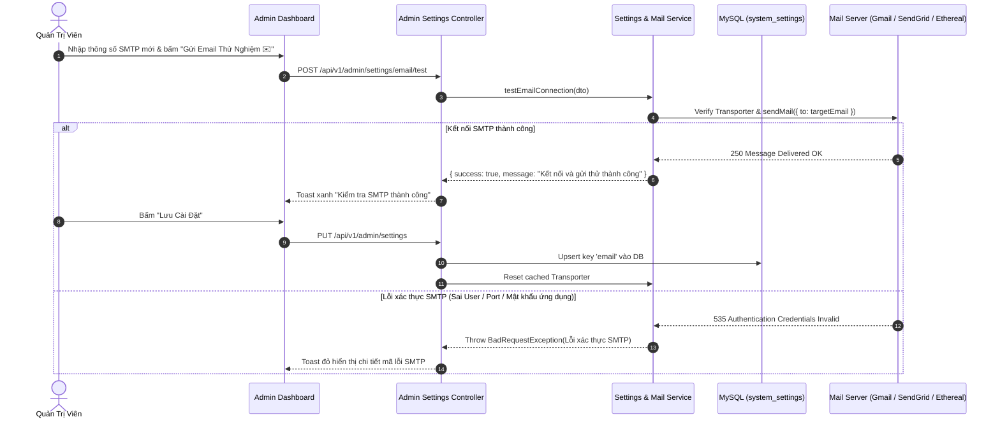

# QUY HOẠCH KỸ THUẬT BACK-END: MODULE THIẾT LẬP HỆ THỐNG (SYSTEM SETTINGS MANAGEMENT)

> **Nguồn ý tưởng:** `.docs/ideas/dashboard/05-settings-idea.md`  
> **Kế hoạch Frontend:** `.docs/frontend-plans/dashboard/05-settings-plan.md`  
> **Ứng dụng mục tiêu:** NestJS Backend API (`apps/backend` / `app/backend`)  
> **Phiên bản:** 2.0.0 (Bổ sung Cấu hình chung nâng cao, Menu Navigation, Thông tin & SEO, Cấu hình Email SMTP & Test Connection)  
> **Ngày cập nhật:** 2026-08-22  

---

## 1. TỔNG QUAN HỆ THỐNG & MỤC TIÊU (OVERVIEW & ARCHITECTURE)

Module **System Settings** chịu trách nhiệm lưu trữ, quản lý, bảo mật và phân phối toàn bộ thông số cấu hình của hệ thống E-commerce TechBite. Hệ thống tập trung quy hoạch 4 phân hệ chính:
1. **Cấu hình chung (General Settings):** Thông tin định danh thương hiệu, logo, favicon, thông tin liên hệ, giờ làm việc, bản quyền và cờ bảo trì hệ thống.
2. **Menu Navigation (Repeater & Hierarchy):** Quản lý động các cây menu Header, Footer đa cột (Col 1, Col 2, Col 3) và Mobile Navigation.
3. **Thông tin & Cấu hình SEO (SEO & Social Metadata):** Cung cấp đầy đủ trường dữ liệu thẻ Meta (Title, Description, Keywords, Canonical, Robots), Open Graph, Twitter Cards, Social Links, cùng mã xác thực Google Search Console / GA4 Scripts (khắc phục điểm thiếu hụt trên UI hiện tại).
4. **Cấu hình Email (SMTP Configuration & Test Mail):** Quản lý cấu hình máy chủ gửi thư (Host, Port, TLS/SSL, Username, Password mã hóa), thông tin người gửi, và API kiểm tra kết nối (Test Mail Connection) theo thời gian thực mà không cần khởi động lại Server.

---

## 2. THIẾT KẾ DỮ LIỆU (DATABASE SCHEMA & ENTITIES)

### 2.1 Prisma Schema (`prisma/schema.prisma`)

```prisma
// =============================================================================
// MODULE: SYSTEM SETTINGS (CẤU HÌNH HỆ THỐNG TỔNG THỂ)
// Source: .docs/backend-plans/dashboard/05-settings-plan.md
// =============================================================================

/// Lưu trữ các thông số cấu hình hệ thống dạng Key-Value JSON
/// Các key chính: 'general', 'menus', 'seo', 'email', 'payment', 'shipping'
model SystemSetting {
  id        Int      @id @default(autoincrement())
  key       String   @unique @db.VarChar(100)
  value     Json     // Dữ liệu cấu hình dạng JSON cấu trúc chặt chẽ
  updatedAt DateTime @updatedAt

  @@index([key], name: "idx_setting_key")
  @@map("system_settings")
}
```

### 2.2 Cấu trúc Chi tiết 4 Nhóm Dữ liệu JSON trong `SystemSetting`

#### Nhóm 1: `general` (Cấu hình chung)
```json
{
  "storeName": "TechBite - Chuỗi Cửa Hàng Công Nghệ & Đồ Ăn Đỉnh Cao",
  "storeEmail": "contact@techbite.vn",
  "storePhone": "1900 6868",
  "hotline": "0988 123 456",
  "storeAddress": "Tầng 12, Tòa nhà Innovation Tower, Cầu Giấy, Hà Nội",
  "copyrightText": "© 2026 TechBite E-Commerce Platform. All rights reserved.",
  "logoUrl": "/uploads/images/logo-techbite.png",
  "faviconUrl": "/uploads/images/favicon.ico",
  "workingHours": "08:00 - 22:00 (Thứ 2 - Chủ Nhật)",
  "taxCode": "0109988776",
  "maintenanceMode": false,
  "maintenanceMessage": "Hệ thống đang bảo trì nâng cấp định kỳ. Vui lòng quay lại sau ít phút!"
}
```

#### Nhóm 2: `menus` (Menu Navigation)
```json
[
  {
    "id": "menu-nav-1",
    "title": "Trang chủ",
    "targetUrl": "/",
    "location": "HEADER",
    "icon": "Home",
    "order": 1,
    "openInNewTab": false,
    "isActive": true,
    "children": []
  },
  {
    "id": "menu-nav-2",
    "title": "Sản phẩm & Thực đơn",
    "targetUrl": "/products",
    "location": "HEADER",
    "icon": "Utensils",
    "order": 2,
    "openInNewTab": false,
    "isActive": true,
    "children": [
      {
        "id": "menu-nav-2-1",
        "title": "Burger & Combo Đỉnh Cao",
        "targetUrl": "/categories/burger-combo",
        "order": 1,
        "isActive": true
      }
    ]
  },
  {
    "id": "menu-nav-3",
    "title": "Về chúng tôi",
    "targetUrl": "/about",
    "location": "FOOTER_COL1",
    "order": 1,
    "openInNewTab": false,
    "isActive": true
  },
  {
    "id": "menu-nav-4",
    "title": "Chính sách đổi trả & Hoàn tiền",
    "targetUrl": "/policy/returns",
    "location": "FOOTER_COL2",
    "order": 1,
    "openInNewTab": false,
    "isActive": true
  }
]
```

#### Nhóm 3: `seo` (Thông tin & SEO Metadata)
```json
{
  "metaTitle": "TechBite - Sàn Thương Mại Điện Tử & Đặt Món Công Nghệ Hàng Đầu",
  "metaDescription": "Trải nghiệm mua sắm thiết bị công nghệ & ẩm thực nhanh chất lượng cao, giao hàng hỏa tốc trong 30 phút cùng TechBite.",
  "metaKeywords": "TechBite, E-commerce, FastFood, Công nghệ, Đặt món trực tuyến",
  "canonicalUrl": "https://techbite.vn",
  "metaRobots": "index, follow",
  "ogTitle": "TechBite - Trải Nghiệm Mua Sắm Đỉnh Cao",
  "ogDescription": "Khám phá hàng ngàn ưu đãi công nghệ và đồ ăn nhanh hấp dẫn mỗi ngày.",
  "ogImageUrl": "/uploads/images/techbite-og-banner.jpg",
  "ogType": "website",
  "twitterCard": "summary_large_image",
  "twitterSite": "@techbite_vn",
  "facebookUrl": "https://facebook.com/techbite.vietnam",
  "zaloUrl": "https://zalo.me/techbite",
  "instagramUrl": "https://instagram.com/techbite_official",
  "tiktokUrl": "https://tiktok.com/@techbite.store",
  "youtubeUrl": "https://youtube.com/@techbite_vietnam",
  "googleSiteVerification": "google-site-verification-token-sample-123456",
  "googleAnalyticsId": "G-TECHBITE999",
  "customHeadScript": "<!-- Google Tag Manager / Custom Head Scripts -->",
  "customBodyScript": "<!-- Custom Body Scripts -->"
}
```

#### Nhóm 4: `email` (Cấu hình Email SMTP)
```json
{
  "mailDriver": "smtp",
  "smtpHost": "smtp.gmail.com",
  "smtpPort": 587,
  "smtpEncryption": "tls",
  "smtpUser": "no-reply@techbite.vn",
  "smtpPassword": "encrypted_app_password_or_token",
  "fromName": "TechBite Platform",
  "fromEmail": "no-reply@techbite.vn",
  "replyToEmail": "support@techbite.vn",
  "adminAlertEmail": "admin@techbite.vn",
  "enableOrderAlertAdmin": true,
  "enableWelcomeMail": true
}
```

---

## 3. GIAO KÈO API (API CONTRACT & DTOS)

### 3.1 Bảng Tổng Hợp Endpoints

| Nhóm | Method | Route Path | Phân Quyền | Caching / Invalidation | Mục Đích |
|---|---|---|---|---|---|
| **Admin Settings** | `GET` | `/api/v1/admin/settings` | `ADMIN`, `STAFF` | No Cache (DB Master) | Lấy toàn bộ 4 nhóm cấu hình cho Admin Dashboard |
| **Admin Settings** | `PUT` | `/api/v1/admin/settings` | `ADMIN` | Invalidate Redis Public Cache | Cập nhật cấu hình tổng thể hoặc từng tab độc lập |
| **Admin Settings** | `GET` | `/api/v1/admin/settings/:group` | `ADMIN`, `STAFF` | No Cache | Lấy chi tiết 1 nhóm: `general`, `menus`, `seo`, `email` |
| **Admin Settings** | `PATCH` | `/api/v1/admin/settings/:group` | `ADMIN` | Invalidate Redis Public Cache | Cập nhật nhanh 1 nhóm cấu hình đơn lẻ |
| **Admin Email** | `POST` | `/api/v1/admin/settings/email/test` | `ADMIN` | No Cache | Gửi thử nghiệm 1 email test SMTP xác thực cấu hình |
| **Public Storefront** | `GET` | `/api/v1/settings/public` | Public | Redis Cache 1h (`cache:v1:settings:public`) | Lấy thông tin chung, navigation menus, footer cho Storefront |
| **Public Storefront** | `GET` | `/api/v1/settings/seo` | Public | Redis Cache 1h (`cache:v1:settings:seo`) | Lấy đầy đủ thẻ meta SEO, OpenGraph, GA4 cho Next.js Metadata API |
| **Public Storefront** | `GET` | `/api/v1/settings/menus` | Public | Redis Cache 1h (`cache:v1:settings:menus`) | Lấy danh sách menu Header & Footer đã lọc `isActive: true` |

---

### 3.2 Đặc Tả DTOs & Validation Rules (TypeScript)

#### 1. DTO Cấu hình chung (`general-settings.dto.ts`)
```typescript
import { IsBoolean, IsEmail, IsNotEmpty, IsOptional, IsString } from 'class-validator';

export class GeneralSettingsDto {
  @IsString()
  @IsNotEmpty({ message: 'Tên cửa hàng không được để trống' })
  storeName: string;

  @IsEmail({}, { message: 'Email liên hệ không đúng định dạng' })
  @IsNotEmpty({ message: 'Email liên hệ không được để trống' })
  storeEmail: string;

  @IsString()
  @IsNotEmpty({ message: 'Số điện thoại không được để trống' })
  storePhone: string;

  @IsOptional()
  @IsString()
  hotline?: string;

  @IsString()
  @IsNotEmpty({ message: 'Địa chỉ cửa hàng không được để trống' })
  storeAddress: string;

  @IsString()
  copyrightText: string;

  @IsOptional()
  @IsString()
  logoUrl?: string;

  @IsOptional()
  @IsString()
  faviconUrl?: string;

  @IsOptional()
  @IsString()
  workingHours?: string;

  @IsOptional()
  @IsString()
  taxCode?: string;

  @IsOptional()
  @IsBoolean()
  maintenanceMode?: boolean;

  @IsOptional()
  @IsString()
  maintenanceMessage?: string;
}
```

#### 2. DTO Menu Navigation (`menu-settings.dto.ts`)
```typescript
import { IsArray, IsBoolean, IsEnum, IsInt, IsNotEmpty, IsOptional, IsString, ValidateNested } from 'class-validator';
import { Type } from 'class-transformer';

export enum MenuLocation {
  HEADER = 'HEADER',
  FOOTER_COL1 = 'FOOTER_COL1',
  FOOTER_COL2 = 'FOOTER_COL2',
  FOOTER_COL3 = 'FOOTER_COL3',
  MOBILE = 'MOBILE',
}

export class SubMenuItemDto {
  @IsString()
  @IsNotEmpty()
  id: string;

  @IsString()
  @IsNotEmpty({ message: 'Tiêu đề menu con không được để trống' })
  title: string;

  @IsString()
  @IsNotEmpty({ message: 'Đường dẫn liên kết không được để trống' })
  targetUrl: string;

  @IsInt()
  order: number;

  @IsBoolean()
  isActive: boolean;
}

export class MenuItemSettingDto {
  @IsString()
  @IsNotEmpty()
  id: string;

  @IsString()
  @IsNotEmpty({ message: 'Tiêu đề menu không được để trống' })
  title: string;

  @IsString()
  @IsNotEmpty({ message: 'Đường dẫn liên kết không được để trống' })
  targetUrl: string;

  @IsEnum(MenuLocation, { message: 'Vị trí menu không hợp lệ' })
  location: MenuLocation;

  @IsOptional()
  @IsString()
  icon?: string;

  @IsInt()
  order: number;

  @IsBoolean()
  openInNewTab: boolean;

  @IsBoolean()
  isActive: boolean;

  @IsOptional()
  @IsArray()
  @ValidateNested({ each: true })
  @Type(() => SubMenuItemDto)
  children?: SubMenuItemDto[];
}
```

#### 3. DTO Thông tin & SEO (`seo-settings.dto.ts`)
```typescript
import { IsOptional, IsString, MaxLength } from 'class-validator';

export class SeoSocialSettingsDto {
  @IsString()
  @MaxLength(120, { message: 'Meta Title không nên vượt quá 120 ký tự' })
  @IsNotEmpty({ message: 'Meta Title không được để trống' })
  metaTitle: string;

  @IsString()
  @MaxLength(300, { message: 'Meta Description không nên vượt quá 300 ký tự' })
  @IsNotEmpty({ message: 'Meta Description không được để trống' })
  metaDescription: string;

  @IsString()
  metaKeywords: string;

  @IsOptional()
  @IsString()
  canonicalUrl?: string;

  @IsOptional()
  @IsString()
  metaRobots?: string; // 'index, follow' | 'noindex, nofollow'

  @IsOptional()
  @IsString()
  ogTitle?: string;

  @IsOptional()
  @IsString()
  ogDescription?: string;

  @IsOptional()
  @IsString()
  ogImageUrl?: string;

  @IsOptional()
  @IsString()
  ogType?: string; // 'website'

  @IsOptional()
  @IsString()
  twitterCard?: string; // 'summary_large_image'

  @IsOptional()
  @IsString()
  twitterSite?: string;

  @IsOptional()
  @IsString()
  facebookUrl?: string;

  @IsOptional()
  @IsString()
  zaloUrl?: string;

  @IsOptional()
  @IsString()
  instagramUrl?: string;

  @IsOptional()
  @IsString()
  tiktokUrl?: string;

  @IsOptional()
  @IsString()
  youtubeUrl?: string;

  @IsOptional()
  @IsString()
  googleSiteVerification?: string;

  @IsOptional()
  @IsString()
  googleAnalyticsId?: string;

  @IsOptional()
  @IsString()
  customHeadScript?: string;

  @IsOptional()
  @IsString()
  customBodyScript?: string;
}
```

#### 4. DTO Cấu hình Email & Test SMTP (`email-settings.dto.ts`)
```typescript
import { IsBoolean, IsEmail, IsEnum, IsInt, IsNotEmpty, IsOptional, IsString, Max, Min } from 'class-validator';

export enum SmtpEncryption {
  NONE = 'none',
  SSL = 'ssl',
  TLS = 'tls',
}

export class EmailSettingsDto {
  @IsOptional()
  @IsString()
  mailDriver?: string; // default: 'smtp'

  @IsString()
  @IsNotEmpty({ message: 'SMTP Host không được để trống' })
  smtpHost: string;

  @IsInt()
  @Min(1)
  @Max(65535)
  smtpPort: number;

  @IsEnum(SmtpEncryption)
  smtpEncryption: SmtpEncryption;

  @IsString()
  @IsNotEmpty({ message: 'Tài khoản SMTP User không được để trống' })
  smtpUser: string;

  @IsOptional()
  @IsString()
  smtpPassword?: string; // Nếu để trống khi update -> giữ nguyên mật khẩu cũ trong DB

  @IsString()
  @IsNotEmpty({ message: 'Tên người gửi (From Name) không được để trống' })
  fromName: string;

  @IsEmail({}, { message: 'From Email không đúng định dạng' })
  fromEmail: string;

  @IsOptional()
  @IsEmail({}, { message: 'Reply-To Email không đúng định dạng' })
  replyToEmail?: string;

  @IsOptional()
  @IsEmail({}, { message: 'Admin Alert Email không đúng định dạng' })
  adminAlertEmail?: string;

  @IsOptional()
  @IsBoolean()
  enableOrderAlertAdmin?: boolean;

  @IsOptional()
  @IsBoolean()
  enableWelcomeMail?: boolean;
}

export class TestEmailConnectionDto {
  @IsEmail({}, { message: 'Email nhận thử nghiệm không đúng định dạng' })
  @IsNotEmpty({ message: 'Email nhận thử nghiệm không được để trống' })
  targetEmail: string;

  @IsOptional()
  customSettings?: EmailSettingsDto; // Cho phép test trực tiếp thông số nhập trên Form trước khi lưu
}
```

---

### 3.3 Chi Tiết Response Payload

#### Response: `GET /api/v1/admin/settings` (200 OK)
```json
{
  "statusCode": 200,
  "message": "Lấy thông tin thiết lập hệ thống thành công",
  "data": {
    "general": {
      "storeName": "TechBite - Chuỗi Cửa Hàng Công Nghệ & Đồ Ăn Đỉnh Cao",
      "storeEmail": "contact@techbite.vn",
      "storePhone": "1900 6868",
      "hotline": "0988 123 456",
      "storeAddress": "Tầng 12, Tòa nhà Innovation Tower, Cầu Giấy, Hà Nội",
      "copyrightText": "© 2026 TechBite E-Commerce Platform.",
      "logoUrl": "/uploads/images/logo-techbite.png",
      "faviconUrl": "/uploads/images/favicon.ico",
      "workingHours": "08:00 - 22:00",
      "maintenanceMode": false
    },
    "menus": [
      {
        "id": "menu-nav-1",
        "title": "Trang chủ",
        "targetUrl": "/",
        "location": "HEADER",
        "icon": "Home",
        "order": 1,
        "openInNewTab": false,
        "isActive": true,
        "children": []
      }
    ],
    "seo": {
      "metaTitle": "TechBite - Sàn Thương Mại Điện Tử Công Nghệ",
      "metaDescription": "Mua sắm thiết bị công nghệ & đồ ăn chất lượng cao...",
      "metaKeywords": "TechBite, E-commerce, FastFood",
      "canonicalUrl": "https://techbite.vn",
      "metaRobots": "index, follow",
      "ogImageUrl": "/uploads/images/techbite-og-banner.jpg",
      "facebookUrl": "https://facebook.com/techbite.vietnam",
      "zaloUrl": "https://zalo.me/techbite"
    },
    "email": {
      "mailDriver": "smtp",
      "smtpHost": "smtp.gmail.com",
      "smtpPort": 587,
      "smtpEncryption": "tls",
      "smtpUser": "no-reply@techbite.vn",
      "hasPasswordConfigured": true,
      "fromName": "TechBite Platform",
      "fromEmail": "no-reply@techbite.vn",
      "replyToEmail": "support@techbite.vn",
      "adminAlertEmail": "admin@techbite.vn",
      "enableOrderAlertAdmin": true,
      "enableWelcomeMail": true
    }
  }
}
```

> [!IMPORTANT]
> **Bảo mật Payload:** Tuyệt đối **KHÔNG** trả về `smtpPassword` dạng thô trong API Response. Trả về cờ `hasPasswordConfigured: true` để Frontend hiển thị trạng thái đã thiết lập mật khẩu mà không làm lộ credentials.

---

## 4. XỬ LÝ BẤT ĐỒNG BỘ, CACHING & DYNAMIC SMTP (ARCHITECTURE)

### 4.1 Cơ Chế Dynamic SMTP Transporter trong `MailService`
Để tránh việc khởi động lại ứng dụng NestJS mỗi khi Quản trị viên thay đổi tài khoản hoặc mật khẩu SMTP:
1. `MailService` quản lý một biến `cachedTransporter` và cờ `lastConfigHash`.
2. Khi thực hiện gửi email (`sendOrderConfirmation`, `sendRegisterWelcome`, `testConnection`), `MailService` đọc cấu hình `email` từ bảng `system_settings` (hoặc cache Redis).
3. Nếu cấu hình thay đổi (hoặc chưa khởi tạo), `MailService` khởi tạo lại `nodemailer.createTransport({...})` tương ứng tức thì.



---

### 4.2 Chiến Lược Caching & Invalidation Redis

1. **Public Settings Cache Key:** `cache:v1:settings:public` (TTL: 3600s).
2. **SEO Metadata Cache Key:** `cache:v1:settings:seo` (TTL: 3600s).
3. **Navigation Menus Cache Key:** `cache:v1:settings:menus` (TTL: 3600s).
4. **Invalidation Trigger:** Khi có bất kỳ request `PUT /api/v1/admin/settings` hoặc `PATCH /api/v1/admin/settings/:group`, hệ thống xóa toàn bộ các key cache liên quan trên Redis (`cache:v1:settings:*`) đảm bảo Client nhận ngay dữ liệu mới nhất.

---

## 5. BẢO MẬT & PHÂN QUYỀN (SECURITY & ROLE GUARDS)

1. **Authentication:** Bắt buộc áp dụng `JwtAuthGuard` cho toàn bộ các route `/api/v1/admin/settings/**`.
2. **Role Authorization:** 
   - Quyền `ADMIN`: Toàn quyền xem và chỉnh sửa tất cả 4 nhóm (`general`, `menus`, `seo`, `email`), thực hiện gửi Test Email.
   - Quyền `STAFF`: Chỉ được phép xem (`GET`) cấu hình chung và menu, **CẤM** xem hoặc thay đổi cấu hình `email` và `seo`.
3. **Mã hóa Mật khẩu SMTP:** Mật khẩu SMTP lưu trong database phải được mã hóa 2 chiều an toàn bằng thuật toán AES-256-GCM với Secret Key từ biến môi trường `APP_ENCRYPTION_KEY`.

---

## 6. LỘ TRÌNH THI CÔNG CHI TIẾT (IMPLEMENTATION CHECKLIST)

- [ ] **Bước 1 (DTOs & Interfaces):** Khởi tạo đầy đủ các file DTOs: `general-settings.dto.ts`, `menu-settings.dto.ts`, `seo-settings.dto.ts`, `email-settings.dto.ts`, `update-system-settings.dto.ts` trong thư mục `src/settings/dto/`.
- [ ] **Bước 2 (Dynamic Mail Transport):** Nâng cấp `MailService` trong `src/mail/mail.service.ts` để đọc cấu hình SMTP trực tiếp từ DB `SystemSetting` thay vì chỉ dùng `.env`, bổ sung method `testSmtpConnection(dto)`.
- [ ] **Bước 3 (Admin Settings Service & Controller):**
  - Mở rộng `SettingsService` hỗ trợ lấy và cập nhật từng nhóm cấu hình (`general`, `menus`, `seo`, `email`).
  - Xử lý che giấu mật khẩu `smtpPassword` khi trả về response cho client.
  - Thêm endpoint `POST /api/v1/admin/settings/email/test` trong `AdminSettingsController`.
- [ ] **Bước 4 (Public Storefront Endpoints):**
  - Thêm endpoint `GET /api/v1/settings/seo` và `GET /api/v1/settings/menus` trong `SettingsController` có tích hợp Caching Redis.
- [ ] **Bước 5 (Database Seeding):** Cập nhật `prisma/seed.ts` để khởi tạo dữ liệu mẫu chuẩn hóa cho cả 4 nhóm `general`, `menus`, `seo`, `email`.
- [ ] **Bước 6 (Kiểm thử Build & Type Check):** Chạy `npm run build` trên `app/backend` đảm bảo 0 lỗi TypeScript (`npx tsc --noEmit`).
