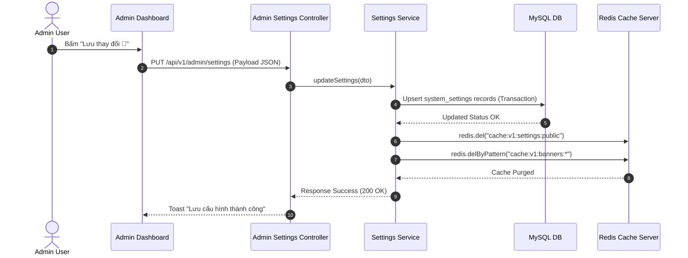

# QUY HOẠCH KỸ THUẬT BACK-END: MODULE QUẢN LÝ THIẾT LẬP HỆ THỐNG & BANNER (ADMIN SETTINGS & BANNERS)

> **Nguồn ý tưởng:** `.docs/ideas/dashboard/05-settings-idea.md`  
> **Kế hoạch Frontend:** `.docs/frontend-plans/dashboard/05-settings-plan.md`  
> **Ứng dụng mục tiêu:** NestJS Backend API (`apps/backend` / `app/backend`)  
> **Phiên bản:** 1.0.0  
> **Ngày tạo:** 2026-08-14  

---

## 1. TỔNG QUAN HỆ THỐNG & MỤC TIÊU (OVERVIEW & ARCHITECTURE)

Module **System Settings & Banner Management** chịu trách nhiệm lưu trữ, quản lý và phân phối toàn bộ thông số cấu hình của hệ thống E-commerce TechBite (Thông tin cửa hàng, tài khoản VietQR, chính sách giao hàng, danh mục Menu Navigation, thẻ SEO/Social) và hệ thống Banner quảng cáo động (Hero Banner, Promotion Banner, Popup Banner).

### Các yêu cầu kỹ thuật cốt lõi:
1. **Lưu trữ Cấu hình Linh hoạt (Dynamic Key-Value JSON):** Sử dụng bảng `system_settings` lưu trữ các nhóm cấu hình (`general`, `payment`, `shipping`, `menus`, `seo`) dưới dạng JSON chuẩn hóa, dễ dàng mở rộng thêm các field mới mà không cần migration lại DB.
2. **Quản lý Banner Chuẩn Enterprise:** Mở rộng bảng `banners` hỗ trợ phân loại `category` (`HOME`, `PRODUCT`), vị trí `position` (`HERO_BANNER`, `PROMOTION_BANNER`, `POPUP_BANNER`), thứ tự hiển thị `order` và bật/tắt `isActive`.
3. **Caching Redis Siêu Tốc & Tự Động Invalidate:** Cache public settings và banners trên Redis với TTL 1 giờ. Khi Admin bấm lưu cấu hình hoặc cập nhật banner, hệ thống tự động xóa rác cache trên Redis (`cache:v1:settings:*`, `cache:v1:banners:*`) để Frontend cập nhật ngay tức thì.
4. **Tự động Dọn dẹp File Ảnh Cũ:** Kết nối `UploadService` để tự động xóa file vật lý trên ổ đĩa khi Admin xóa Banner hoặc thay thế logo/favicon/banner image mới.
5. **Bảo mật & Phân quyền Strict:** Tất cả API Admin bắt buộc đi qua `JwtAuthGuard` và `RolesGuard` (yêu cầu vai trò `ADMIN` hoặc `STAFF`).

---

## 2. THIẾT KẾ DỮ LIỆU (DATABASE SCHEMA)

### 2.1 Mở rộng Bảng `banners` và Bổ sung Enums trong Prisma Schema

```prisma
// =============================================================================
// MODULE: SYSTEM SETTINGS & BANNERS
// Source: .docs/backend-plans/dashboard/05-settings-plan.md
// =============================================================================

enum BannerCategory {
  HOME
  PRODUCT
}

enum BannerPosition {
  HERO_BANNER
  PROMOTION_BANNER
  POPUP_BANNER
}

/// Lưu trữ danh sách Banner quảng cáo trên Trang chủ và Trang sản phẩm
model Banner {
  id          Int            @id @default(autoincrement())
  title       String         @db.VarChar(255)
  subtitle    String?        @db.VarChar(255)
  imageUrl    String         @db.VarChar(500)
  linkUrl     String?        @db.VarChar(500)
  category    BannerCategory @default(HOME)
  position    BannerPosition @default(HERO_BANNER)
  order       Int            @default(0)
  isActive    Boolean        @default(true)
  createdAt   DateTime       @default(now())
  updatedAt   DateTime       @updatedAt

  @@index([category, position, isActive, order], name: "idx_banner_filter")
  @@index([isActive, order], name: "idx_banner_active_order")
  @@map("banners")
}

/// Lưu trữ các thông số cấu hình hệ thống dạng Key-Value JSON
model SystemSetting {
  id        Int      @id @default(autoincrement())
  key       String   @unique @db.VarChar(100) // 'general', 'payment', 'shipping', 'menus', 'seo'
  value     Json     // Dữ liệu cấu hình dạng JSON
  updatedAt DateTime @updatedAt

  @@index([key], name: "idx_setting_key")
  @@map("system_settings")
}
```

---

## 3. GIAO KÈO API (API CONTRACT & DTOS)

### 3.1 Nhóm API Admin Settings (`/api/v1/admin/settings`)

#### 1. `GET /api/v1/admin/settings`
- **Mục đích:** Lấy toàn bộ thông tin thiết lập hệ thống (General, Payment, Shipping, Banners, Menus, SEO) để hiển thị lên Admin Dashboard.
- **Bảo mật:** `JwtAuthGuard` + `RolesGuard(ADMIN, STAFF)`
- **Response Success (200 OK):**
```json
{
  "statusCode": 200,
  "message": "Lấy thông tin thiết lập hệ thống thành công",
  "data": {
    "general": {
      "storeName": "TechBite - Chuỗi Cửa Hàng Công Nghệ",
      "storeEmail": "contact@techbite.vn",
      "storePhone": "1900 6868",
      "storeAddress": "Tầng 12, Tòa nhà Innovation Tower, Cầu Giấy, Hà Nội",
      "copyrightText": "© 2026 TechBite E-Commerce Platform.",
      "logoUrl": "/uploads/images/logo-techbite.png",
      "faviconUrl": "/uploads/images/favicon.ico"
    },
    "payment": {
      "bankName": "MB Bank",
      "bankAccountNo": "9999888899",
      "bankAccountHolder": "CTY TNHH TECHBITE VIETNAM",
      "vietQrTemplate": "compact",
      "enableCod": true,
      "paymentNote": "Vui lòng kiểm tra lại đúng Mã Đơn Hàng trong nội dung..."
    },
    "shipping": {
      "defaultShippingFee": 30000,
      "freeShippingThreshold": 500000,
      "estimatedDeliveryTime": "24 - 48 giờ đối với nội thành"
    },
    "banners": [
      {
        "id": 1,
        "title": "Đại Tiệc Công Nghệ TechBite 2026 🚀",
        "subtitle": "Giảm tới 50% cho tất cả thiết bị thông minh",
        "imageUrl": "/uploads/images/banner-hero-1.webp",
        "targetUrl": "/products?discount=true",
        "category": "HOME",
        "position": "HERO_BANNER",
        "order": 1,
        "isActive": true
      }
    ],
    "menus": [
      {
        "id": "m-1",
        "title": "Trang chủ",
        "targetUrl": "/",
        "location": "HEADER",
        "icon": "Home",
        "order": 1,
        "openInNewTab": false,
        "isActive": true
      }
    ],
    "seo": {
      "metaTitle": "TechBite - Sàn Thương Mại Điện Tử Công Nghệ",
      "metaDescription": "Mua sắm thiết bị công nghệ chính hãng...",
      "metaKeywords": "TechBite, E-commerce, Công nghệ",
      "facebookUrl": "https://facebook.com/techbite.vietnam",
      "zaloUrl": "https://zalo.me/techbite",
      "instagramUrl": "https://instagram.com/techbite_official",
      "tiktokUrl": "https://tiktok.com/@techbite.store"
    }
  }
}
```

#### 2. `PUT /api/v1/admin/settings`
- **Mục đích:** Cập nhật đồng loạt các nhóm cấu hình hệ thống (`general`, `payment`, `shipping`, `menus`, `seo`).
- **Bảo mật:** `JwtAuthGuard` + `RolesGuard(ADMIN)`
- **Request Body Payload (`UpdateSystemSettingsDto`):**
```json
{
  "general": {
    "storeName": "TechBite Official Store",
    "storeEmail": "contact@techbite.vn",
    "storePhone": "1900 6868",
    "storeAddress": "Số 1 Đại Cồ Việt, Hai Bà Trưng, Hà Nội",
    "copyrightText": "© 2026 TechBite Inc.",
    "logoUrl": "/uploads/images/logo-v2.png",
    "faviconUrl": "/uploads/images/favicon-v2.ico"
  },
  "payment": {
    "bankName": "MB Bank",
    "bankAccountNo": "9999888899",
    "bankAccountHolder": "CTY TNHH TECHBITE VIETNAM",
    "vietQrTemplate": "compact",
    "enableCod": true,
    "paymentNote": "Ghi rõ mã đơn hàng khi chuyển khoản"
  },
  "shipping": {
    "defaultShippingFee": 30000,
    "freeShippingThreshold": 500000,
    "estimatedDeliveryTime": "24 - 48 giờ"
  },
  "menus": [
    {
      "id": "m-1",
      "title": "Trang chủ",
      "targetUrl": "/",
      "location": "HEADER",
      "icon": "Home",
      "order": 1,
      "openInNewTab": false,
      "isActive": true
    }
  ],
  "seo": {
    "metaTitle": "TechBite Store",
    "metaDescription": "Cửa hàng công nghệ hàng đầu",
    "metaKeywords": "TechBite, Công nghệ",
    "facebookUrl": "https://facebook.com/techbite",
    "zaloUrl": "https://zalo.me/techbite",
    "instagramUrl": "",
    "tiktokUrl": ""
  }
}
```
- **Response Success (200 OK):**
```json
{
  "statusCode": 200,
  "message": "Cập nhật thiết lập hệ thống thành công",
  "data": { "success": true }
}
```

---

### 3.2 Nhóm API Admin Banners (`/api/v1/admin/banners`)

#### 1. `GET /api/v1/admin/banners`
- **Query Parameters:**
  - `category` (optional): `'HOME'` | `'PRODUCT'`
  - `position` (optional): `'HERO_BANNER'` | `'PROMOTION_BANNER'` | `'POPUP_BANNER'`
  - `search` (optional): Từ khóa tìm kiếm theo tiêu đề banner
- **Response Success (200 OK):** Trả về danh sách Banner đầy đủ (bao gồm cả banner inactive) xếp theo `order` tăng dần.

#### 2. `POST /api/v1/admin/banners`
- **Request Body Payload (`CreateBannerDto`):**
```json
{
  "title": "Banner Khuyến Mãi Mới",
  "subtitle": "Mô tả ngắn banner",
  "imageUrl": "/uploads/images/banner-new.webp",
  "targetUrl": "/products?sale=true",
  "category": "HOME",
  "position": "HERO_BANNER",
  "order": 1,
  "isActive": true
}
```

#### 3. `PATCH /api/v1/admin/banners/:id`
- **Request Body Payload (`UpdateBannerDto`):** Cho phép cập nhật từng phần thông tin Banner.

#### 4. `DELETE /api/v1/admin/banners/:id`
- **Mục đích:** Xóa Banner khỏi cơ sở dữ liệu và tự động gọi `UploadService` để xóa tập tin hình ảnh thực tế trên đĩa server.

#### 5. `PATCH /api/v1/admin/banners/reorder`
- **Request Body Payload (`ReorderBannersDto`):**
```json
{
  "items": [
    { "id": 1, "order": 1 },
    { "id": 2, "order": 2 },
    { "id": 3, "order": 3 }
  ]
}
```

---

### 3.3 Nhóm API Public Storefront (`/api/v1/settings` & `/api/v1/banners`)

#### 1. `GET /api/v1/settings/public`
- **Mục đích:** Cung cấp thông tin cấu hình công khai cho ứng dụng Storefront Frontend (`apps/frontend`).
- **Response Data:** Chỉ bao gồm các dữ liệu an toàn (`storeName`, `storePhone`, `storeAddress`, `logoUrl`, `payment` info, `shipping` fee info, `menus`, `seo`).
- **Caching:** Cache trên Redis key `cache:v1:settings:public` (TTL 3600s).

#### 2. `GET /api/v1/banners`
- **Query Params:** `category` (`HOME` / `PRODUCT`), `position` (`HERO_BANNER` / `PROMOTION_BANNER`)
- **Response Data:** Trả về danh sách các Banner active (`isActive: true`) được sắp xếp theo thứ tự `order` tăng dần.
- **Caching:** Cache trên Redis key `cache:v1:banners:${category}:${position}` (TTL 3600s).

---

## 4. QUY TRÌNH XỬ LÝ & LOGIC NGHIỆP VỤ (BUSINESS LOGIC & WORKFLOWS)

### 4.1 Luồng Khởi tạo Dữ liệu Mặc định (Database Seeding)
- Khi khởi tạo hệ thống hoặc chạy script `prisma/seed.ts`, hệ thống tự động kiểm tra xem các key trong `system_settings` (`general`, `payment`, `shipping`, `menus`, `seo`) đã tồn tại chưa.
- Nếu chưa có, tự động tạo mới các record mẫu chuẩn định dạng JSON để ứng dụng Frontend không bao giờ bị lỗi Null Pointer.

### 4.2 Luồng Lưu Cấu Hình & Xóa Rác Cache Redis


### 4.3 Luồng Xóa Banner & Tự động Xóa File Ảnh Vật lý
- Khi gọi `DELETE /api/v1/admin/banners/:id`:
  1. Service tìm banner theo `id`. Nếu không thấy, ném `NotFoundException('Không tìm thấy Banner')`.
  2. Lấy `imageUrl` của banner.
  3. Xóa record Banner khỏi DB trong Prisma.
  4. Gọi `uploadService.deleteImageFile(imageUrl)` để kiểm tra và xóa file vật lý tương ứng trên thư mục `/uploads/images/`.
  5. Xóa Redis cache `cache:v1:banners:*`.

---

## 5. DTO VALIDATION SPECIFICATIONS

```typescript
// create-banner.dto.ts
export class CreateBannerDto {
  @IsString()
  @IsNotEmpty({ message: 'Tiêu đề banner không được để trống' })
  @MaxLength(255)
  title: string;

  @IsOptional()
  @IsString()
  @MaxLength(255)
  subtitle?: string;

  @IsString()
  @IsNotEmpty({ message: 'Hình ảnh banner không được để trống' })
  imageUrl: string;

  @IsOptional()
  @IsString()
  targetUrl?: string;

  @IsEnum(BannerCategory)
  category: BannerCategory;

  @IsEnum(BannerPosition)
  position: BannerPosition;

  @IsOptional()
  @IsInt()
  order?: number;

  @IsOptional()
  @IsBoolean()
  isActive?: boolean;
}
```

---

## 6. LỘ TRÌNH THI CÔNG API (IMPLEMENTATION STEPS FOR BACKEND ENGINE)

1. **Cập nhật Schema & DB Migration:**
   - Cập nhật `schema.prisma` thêm model `SystemSetting`, enum `BannerCategory`, `BannerPosition` và nâng cấp model `Banner`.
   - Chạy `npx prisma db push` & `npx prisma generate`.

2. **Seeding Dữ liệu Mặc định:**
   - Cập nhật `prisma/seed.ts` bổ sung dữ liệu khởi tạo cho `system_settings` và `banners`.

3. **Xây dựng Settings & Banners Modules (`src/settings`, `src/banners`):**
   - Tạo DTOs validation cho Settings & Banners.
   - Viết `AdminSettingsService` và `AdminSettingsController` cho Admin Dashboard.
   - Viết `AdminBannersService` và `AdminBannersController` cho Admin Dashboard.
   - Viết `SettingsController` và `BannersController` cho Storefront Public API.

4. **Tích hợp Cache Management & File Cleanup:**
   - Inject `RedisService` vào Settings/Banners services để quản lý purge cache.
   - Inject `UploadService` vào Banners Service để dọn dẹp tập tin đĩa khi xóa banner.

5. **Kiểm thử API & Zero-Error Check:**
   - Chạy `npm run build` trên `app/backend` đảm bảo 0 lỗi TypeScript và 0 lỗi Validation.
